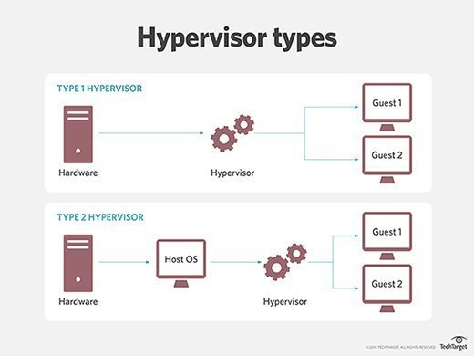
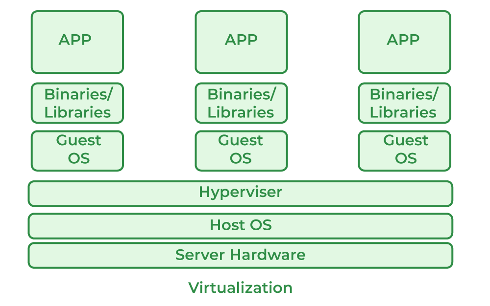

**Virtualization**

It is a technology to create and run multiple virtual instances on a single physical machine/server.

Why we need it ??
1. To test our application in multiple environments like windows, linux, mac with differen versions of OS 
    bcz we don't know that our application will work on different machines , may be the end user might use different version and diff OS.

2. To test our application in multiple environments we create a virtual machine.

**HYPERVISOR:**
It is a software layer that manages the entire Virtualization process.
Types of Hypervisors:
1) Baremetal/Type1 Hypervisor : They run directly on hardware without OS.
        Ex: VMware, Sphere, Xen etc.
2) Hosted / Type2 Hypervisor : They run on the host OS just like an application.
        Ex: VirtualBox, VMware Workstation etc

__Virtual Machine:__

ntg but  an instance created by Hypervisor. 

__Advantages of Using Virtual Machines:__
1) __Isolation:__ Each VM operates independently of the others, providing a secure environment for running applications and services.
2) __Resource Utilization:__ VMs allow for efficient use of hardware resources, enabling multiple VMs to run on a single physical machine.
3) __Testing and Development:__ Developers can test applications in different operating systems and configurations without needing multiple physical machines.
4) __Disaster Recovery:__ VMs can be quickly backed up and restored, facilitating disaster recovery efforts.
5) __Scalability:__ VMs can be easily scaled up or down based on demand, adjusting resources as needed.

__Drawbacks of VMs:__

1) __Cost:__ To run 3 to 4 VMs, we need a high specification physical machine which costs alot.
2) __Resource Utilization:__ by default when we install VM we will get lof of apps which are not useful and which takes more storage.
3) __Speed:__ The speed of starting VMs will take lot of time because it needs to load entire OS.

To overcome the limitations of VMs a new technology came into play nothing but CONTAINERIZATION.To know more information aboutthis concept click on [Containerization](/Theory/2_Docker_Intro.md) 

To know more about Virtualization click [Here](https://www.ibm.com/topics/virtualization)

